# 🚪 Escape The Maze – The Lost Key

> A 2D OpenGL adventure game demonstrating core Computer Graphics concepts through interactive gameplay with immersive audio effects.

<p align="center">
  
  
  
  
  
</p>

<p align="center">
  <b>Built with Computer Graphics fundamentals using OpenGL & GLUT</b>
</p>

---

## Project Description :

**Escape The Maze – The Lost Key** is a 2D adventure maze game developed using **C++ and OpenGL/GLUT**.

The player wakes up inside a mysterious maze and must collect **three hidden keys**, avoid traps and enemies, and escape through the exit door before the timer reaches zero.

This project applies core Computer Graphics concepts through a complete interactive game experience.

---

## Table of Contents :

* [Gameplay Demo](#-gameplay-demo)
* [Screenshots](#-screenshots)
* [Game Flow](#-game-flow-)
* [Code Architecture](#-code-architecture)
* [Characters](#-characters)
* [Game Objects](#-game-objects--)
* [Gameplay Features](#-gameplay-features)
* [Computer Graphics Concepts Applied](#-computer-graphics-concepts-applied-)
* [Controls](#-controls-)
* [Repository Structure](#-repository-structure)
* [How to Run](#-how-to-run)
* [References](#-references)
* [Team Members](#-team-members-)

---

## Gameplay Demo 🎥 :

<p align="center">
  
</p>

<p align="center">
  <b>Escape The Maze – Live Gameplay Preview</b>
</p>

---

## Screenshots :

A quick preview of the game's main scenes and gameplay experience.

| Main Menu                                    | How To Play                                         |
| -------------------------------------------- | --------------------------------------------------- |
| 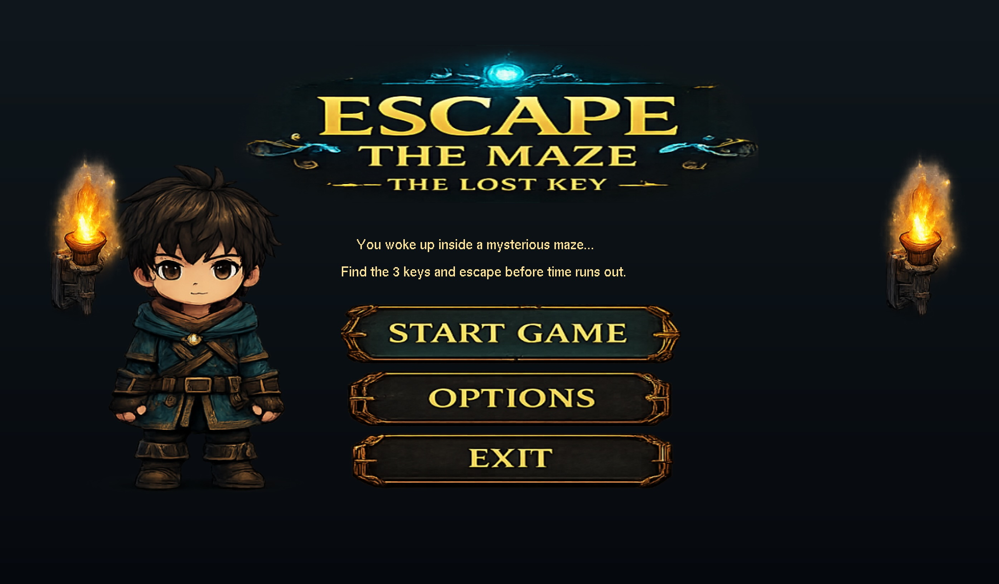 | 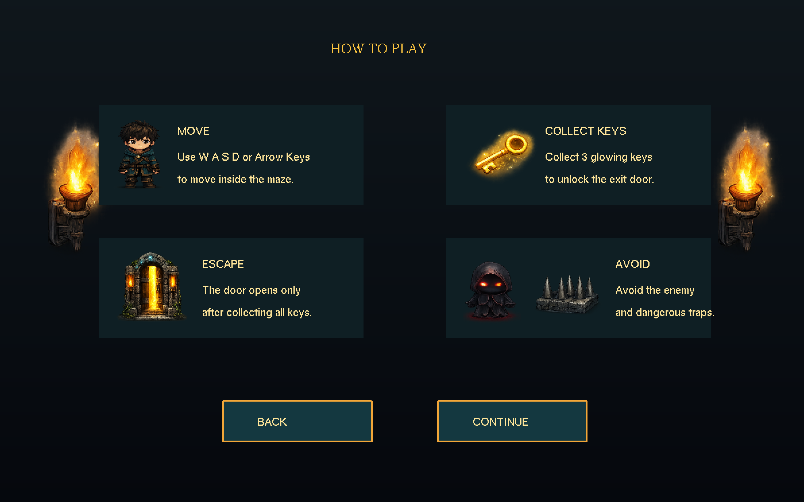 |

| Gameplay                                         | Victory                                         |
| ------------------------------------------------ | ----------------------------------------------- |
| 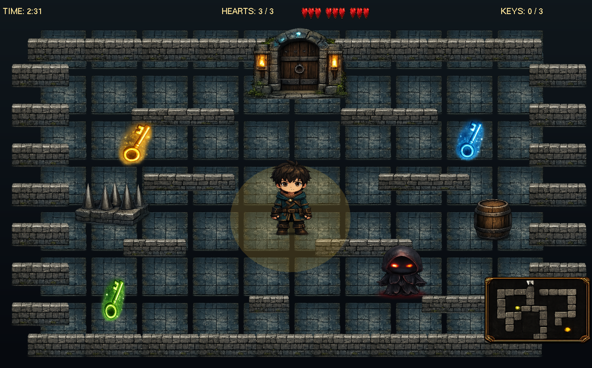 | 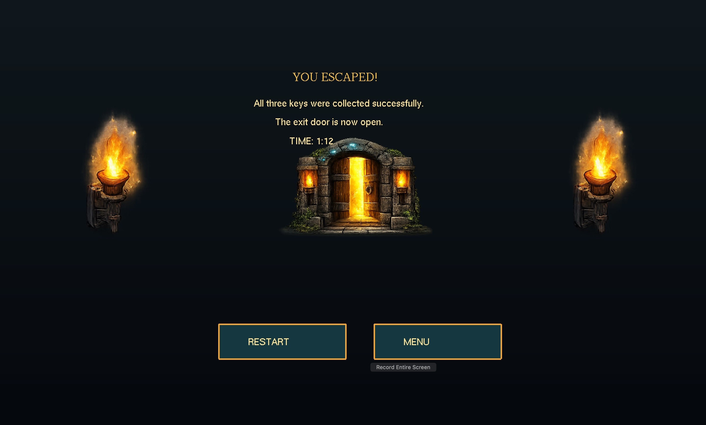 |

| Game Over                                         | Gameplay Demo                            |
| ------------------------------------------------- | ---------------------------------------- |
| 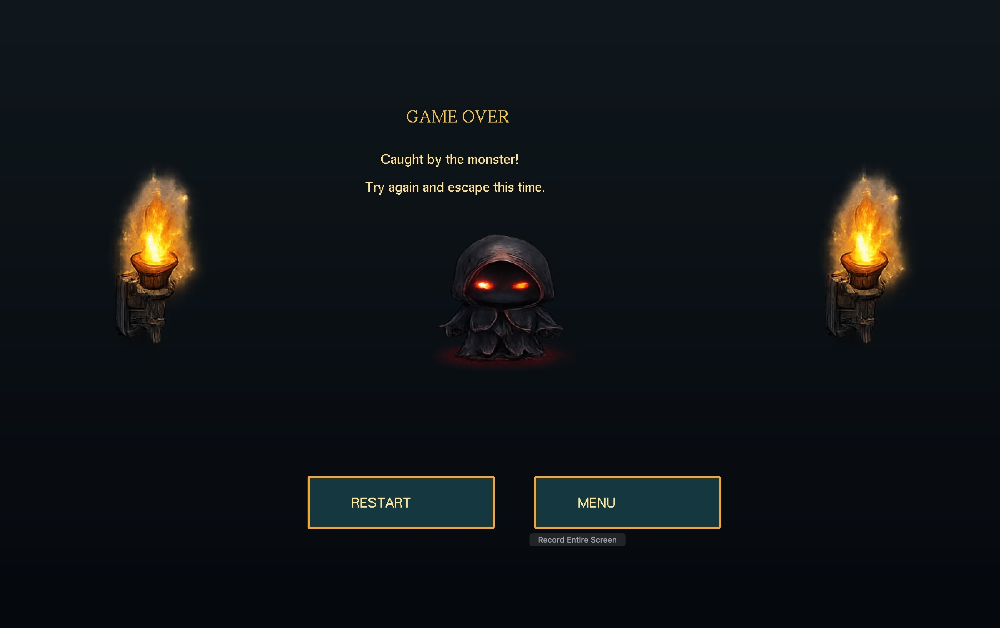 |  |

---

## 🧩 Game Flow

<p align="center">
  
</p>

```text
Main Menu
   ↓
How To Play
   ↓
Intro
   ↓
Gameplay
   ↓
Collect 3 Keys
   ↓
Unlock Door
   ↓
Victory / Game Over
```

---

## Code Architecture :

<p align="center">
  
</p>

```text
main()
  ↓
init()
  ↓
display()
  ↓
keyboard() / mouse()
  ↓
timer()
  ↓
glutMainLoop()
```

---

## Characters :

<p align="center">
  
  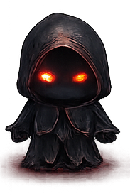
  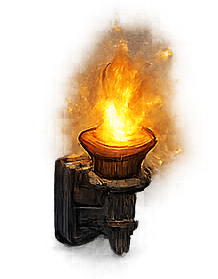
</p>

| Character  | Role                                           |
| ---------- | ---------------------------------------------- |
| **Player** | Main playable character                        |
| **Enemy**  | Causes instant Game Over on collision          |
| **Torch**  | Decorative lighting element used in UI screens |

---

## Game Objects 🗝️ :

<p align="center">
  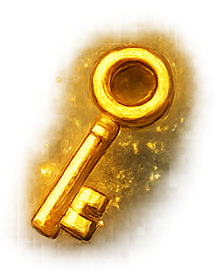
  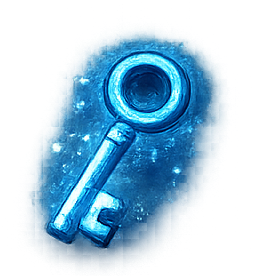
  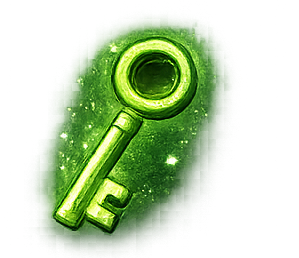
  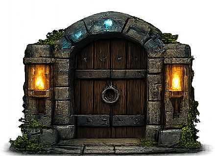
  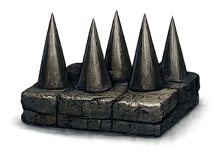
  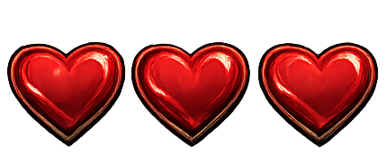
</p>

| Object    | Function                           |
| --------- | ---------------------------------- |
| **Keys**  | The player must collect three keys |
| **Door**  | Opens after collecting all keys    |
| **Trap**  | Reduces player hearts              |
| **Heart** | Represents player health           |
| **Enemy** | Ends the game when touched         |

---

## Gameplay Features 🎮 :

* Main menu with mouse interaction
* How To Play instructions screen
* Story intro screen
* Maze gameplay scene
* Victory screen
* Game Over screen
* Player movement using keyboard
* Key collection system
* Health / hearts system
* Countdown timer
* Trap damage feedback
* Enemy collision
* Door unlock condition
* Background music
* Interactive sound effects
* Audio feedback for gameplay events

---

## Computer Graphics Concepts Applied :

### 1. 2D Object Representation

The game uses rectangles, quads, polygons, and texture-mapped surfaces to represent game objects.

### 2. Texture Mapping

Images are loaded using `stb_image.h` and mapped onto OpenGL quads using texture coordinates.

### 3. Geometric Transformations

| Transformation  | Applied To           |
| --------------- | -------------------- |
| **Translation** | Player movement      |
| **Rotation**    | Spinning keys        |
| **Scaling**     | Door pulse animation |

### 4. 2D Viewing

The project uses an orthographic projection:

```cpp
gluOrtho2D(0, 1000, 0, 700);
```

### 5. User Interaction

| Input        | Usage                         |
| ------------ | ----------------------------- |
| **Keyboard** | Player movement and shortcuts |
| **Mouse**    | Menu buttons and navigation   |

### 6. Animation

The project uses:

```cpp
glutTimerFunc()
```

to update:

* Key rotation
* Door scaling
* Timer countdown
* Damage flash effect

### 7. Collision Detection

Rectangle-based collision detection is used for:

* Walls
* Keys
* Traps
* Enemy
* Door

---

## Controls 🎮:

| Action           | Input         |
| ---------------- | ------------- |
| Move Up          | W / ↑         |
| Move Down        | S / ↓         |
| Move Left        | A / ←         |
| Move Right       | D / →         |
| Start / Continue | Enter / Space |
| Back             | B             |
| Restart          | R             |
| Menu             | M             |
| Exit             | ESC           |

---

## Repository Structure :

```text
Escape-The-Maze-The-Lost-Key/
│
├── README.md
├── main.cpp
├── stb_image.h
│
├── assets/
├── screenshots/
├── characters/
├── objects/
├── diagrams/
├── video/
└── docs/
```

---

## How to Run :

### macOS / Xcode

1. Open the project in **Xcode**
2. Make sure the `assets/` folder (including `assets/audio/`) is added to the project directory
3. Make sure `stb_image.h` is included
4. Build and run using:

```text
Command + R
```

---

## References :

* OpenGL Documentation: https://www.opengl.org/
* FreeGLUT Documentation: https://freeglut.sourceforge.net/
* `stb_image.h` by Sean Barrett: https://github.com/nothings/stb
* macOS `afplay` command-line audio player (used for sound playback)

---

## Team Members 👩‍💻:

| Name                    | Student Number |
| ----------------------- | -------------- |
| **Lina Saud Almatrafi** | 441011792      |
| **Jory Majed Alotaibi** | 44411907       |
| **Fouz Fawaz Alsharif** | 44412064       |
| **Lama Alaofy**         | 44411741       |

---

<p align="center">
  
</p>

<p align="center">
  <b>⭐ Escape The Maze – The Lost Key ⭐</b><br>
  Computer Graphics Project – CS2206
</p>
